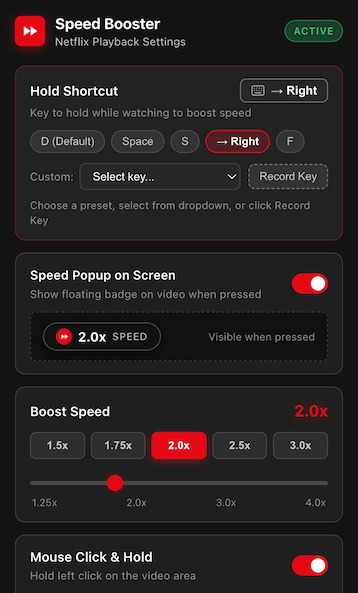

# Netflix Speed Booster (Hold to 2x)

A lightweight Google Chrome extension (Manifest V3) that brings YouTube's hold-to-speed-up feature to Netflix. Hold a key or click and hold with your mouse to speed up playback to 2x (or whatever speed you choose). Let go, and playback drops right back to your previous speed.

<p align="center">
  
</p>

## Why I made this

YouTube has had hold-to-2x for years, and it quickly becomes muscle memory. Netflix only lets you adjust speed through an on-screen menu with rigid steps (0.5x, 0.75x, 1.0x, 1.25x, 1.5x), which takes several clicks and interrupts what you are watching.

This Chrome extension lets you hold down a key (default `D`) or click and hold the video area to temporarily speed it up. Once you let go, your original speed restores immediately.

## What it does

- **Keyboard shortcut**: Hold `D` (or assign `Space`, arrow keys, or any custom key) to boost speed while held.
- **Mouse click-and-hold**: Click and hold the video with your left mouse button. A 250ms buffer ensures regular clicks for play and pause still work normally without accidentally triggering a speedup. Releasing also avoids accidental pausing.
- **Player control friendly**: Key events are handled during the capture phase so Netflix's bottom player controls and scrubber stay hidden while you hold.
- **Natural audio**: Pitch correction stays enabled so audio does not distort into chipmunk voices.
- **Resists playback resets**: Netflix's player code occasionally tries to reset playback rates; the script catches and counters this while your hotkey or mouse is held.
- **Customizable**: Pick any multiplier from 1.25x up to 4.0x, tweak the mouse activation delay, or turn off the on-screen badge if you prefer no visual distractions.
- **Local and private**: Runs purely inside your browser on Netflix pages. No tracking, analytics, remote scripts, or external network requests.

## Installation

You can load the extension directly in Developer mode (works in Google Chrome as well as Brave, Edge, Arc, and other Chromium browsers):

1. Clone or download this repository:
   ```bash
   git clone https://github.com/martinhjartmyr/netflix-speed-booster.git
   ```
2. Open Chrome (or your Chromium browser) and go to:
   ```
   chrome://extensions/
   ```
3. Turn on **Developer mode** using the toggle in the top-right corner.
4. Click **Load unpacked** in the top-left corner.
5. Select the cloned project folder (the directory containing `manifest.json`).
6. Pin the extension to your Chrome toolbar for quick access to settings.

## How to use

1. Go to [netflix.com](https://www.netflix.com) and start playing any title.
2. **Keyboard**: Hold **`D`** to play at 2x. Release the key to return to normal speed.
3. **Mouse**: Click and hold anywhere on the video area. After a short delay (250ms), speed boosts to 2x. Release to return to normal.
4. **Settings**: Click the extension icon in your toolbar (or right-click and choose **Options**) to configure:
   - Shortcut key (quick presets for `D`, `Space`, `S`, `→`, `F`, or record any key)
   - Boost multiplier (1.25x to 4.0x)
   - On-screen speed badge visibility
   - Mouse click-and-hold toggle and activation delay

## Project structure

```
netflix-speed-booster/
├── manifest.json         # Manifest V3 extension configuration
├── screenshot.png        # Settings popup preview
├── content/
│   ├── content.js        # Video detection, speed boost, and event interception
│   └── content.css       # On-screen speed badge styles
├── popup/
│   ├── popup.html        # Settings interface and options page
│   ├── popup.css         # Dark theme styling
│   └── popup.js          # Settings controller and key recorder
├── icons/                # Extension toolbar and web store icons
└── scripts/
    └── generate-icons.py # Script used to generate the PNG icon assets
```

## Permissions

- `storage`: Saves your speed, hotkey, and UI preferences locally in Chrome storage.
- `*://*.netflix.com/*`: Injects the content script to control HTML5 video playback on Netflix.

## License

[MIT](LICENSE)
